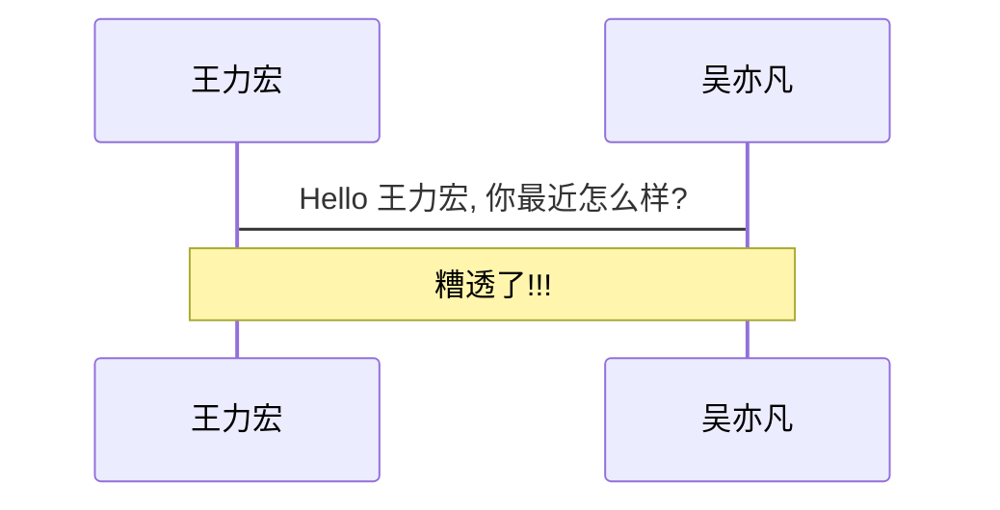
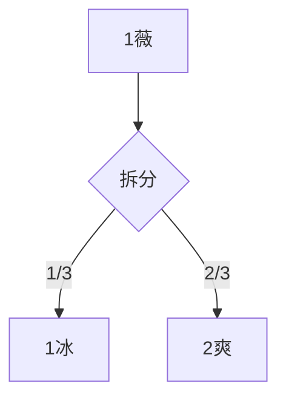
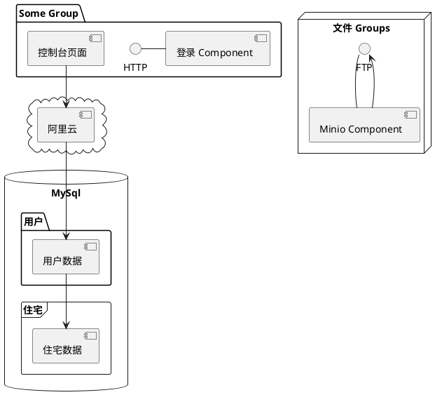

---
# try also 'default' to start simple
theme: default
# random image from a curated Unsplash collection by Anthony
# like them? see https://unsplash.com/collections/94734566/slidev
background: /photo-1616941482131-489295011919.jpg
# apply any windi css classes to the current slide
class: 'text-center'
# https://cn.sli.dev/custom/highlighters.html
highlighter: shiki
# show line numbers in code blocks
lineNumbers: true
# some information about the slides, markdown enabled
info: |
  ## Slidev Starter Template
  Presentation slides for developers.

  Learn more at [Sli.dev](https://sli.dev)
# persist drawings in exports and build
drawings:
  persist: false

fonts:
  # 基础字体
  sans: 'Helvetica Neue'
  # 与 windicss 的 `font-serif` css 类一同使用
  serif: 'Helvetica Neue'
  # 用于代码块、内联代码等
  mono: 'consolas'
---

# Welcome to Slidev

为 developers 提供的演示文稿工具（网站式PPT）

<div class="pt-12">
  <span @click="$slidev.nav.next" class="px-2 py-1 rounded cursor-pointer" hover="bg-white bg-opacity-10">
    按空格键进入下一页 <carbon:arrow-right class="inline"/>
  </span>
</div>

<div class="abs-br m-6 flex gap-2">
  <button @click="$slidev.nav.openInEditor()" title="Open in Editor" class="text-xl icon-btn opacity-50 !border-none !hover:text-white">
    <carbon:edit />
  </button>
  <a href="https://github.com/slidevjs/slidev" target="_blank" alt="GitHub"
    class="text-xl icon-btn opacity-50 !border-none !hover:text-white">
    <carbon-logo-github />
  </a>
</div>

<!--
1. 今天我给大家带来的是 Slidev 
2. 一款网站式 PPT 演示工具
3. 相当于利用网页技术去实现普通 PPT 能实现出来的效果
4. 注明: 这款工具适合开发人员使用
-->

---

# What is Slidev?

Slidev 是一个为开发者设计的幻灯片制作和演示器，包括以下功能

- 📝 **Text-based** - 用 `Markdown` 专注于内容，然后再对它们进行样式设计
- 🎨 **Themable** - 主题可以与 `npm` 包共享和使用
- 🧑‍💻 **Developer Friendly** - 代码高亮，带自动完成的实时编码
- 🤹 **Interactive** - 嵌入 `Vue` 组件以增强你的表达能力
- 🎥 **Recording** - 内置录音和摄像视图
- 📤 **Portable** - 输出为PDF、PNG，甚至是可托管的 SPA
- 🛠 **Hackable** - 网页上的一切可能

<br>
<br>

Read more about [Why Slidev?](https://cn.sli.dev/guide/why)

<!--
You can have `style` tag in markdown to override the style for the current page.
Learn more: https://cn.sli.dev/guide/syntax#embedded-styles
-->

<style>
h1 {
  background-color: #2B90B6;
  background-image: linear-gradient(45deg, #4EC5D4 10%, #146b8c 20%);
  background-size: 100%;
  -webkit-background-clip: text;
  -moz-background-clip: text;
  -webkit-text-fill-color: transparent;
  -moz-text-fill-color: transparent;
}
</style>

<!-- 
1. 相较于传统 PPT 拖拉点击, 这款软件工具更具有编程性质的专业性
2. 基于文本也就是一定的文档编写规范
3. 拥有多套主题, 分享自已创建的主题
4. 代码高亮, 程序员专属
5. 组件高度定制化, 前端开发者福音
6. 内置录音与摄像, 线上讲课更友好
7. 虽然不能直接输出 PPT 文档, 但可以输出 PDF 与 PNG格式, 更加兼容各种场景
 -->

---

# Navigation 导航

悬停在左下角可以看到导航的控制面板, [learn more](https://cn.sli.dev/guide/navigation.html)

### Keyboard Shortcuts

|     |     |
| --- | --- |
| <kbd>right</kbd> / <kbd>space</kbd>| next animation or slide |
| <kbd>left</kbd>  / <kbd>shift</kbd><kbd>space</kbd> | previous animation or slide |
| <kbd>up</kbd> | previous slide |
| <kbd>down</kbd> | next slide |

<!-- https://cn.sli.dev/guide/animations.html#click-animations -->

<p v-after class="absolute bottom-23 left-45 opacity-30 transform -rotate-10">Here!</p>

<!-- 
1. 快捷键也很简单, 上下左右
2. 左右是包含动画, 上下是翻页
3. 左下角也有快速的可视化按钮进行操作
 -->

---


# Icon 图标

Slidev 允许你在 Markdown 中直接访问几乎所有的开源的图标集。这得益于 vite-plugin-icons 和 Iconify。

图标 ID 遵循 Iconify 的命名规则 {collection-name}-{icon-name}。例如：

- 使用 Material Design Icons，其规则为 <mdi-account-circle />
<div class="mt-2 grid grid-cols-24 grid-rows-2">
<div></div>
<mdi-account-circle />
<mdi-account-alert />
<mdi-account-multiple-minus />
<mdi-account-plus />
<mdi-account-tie-hat />
<mdi-account-multiple-minus-outline />
<mdi-account-supervisor-outline />
<mdi-airplane-settings />
<mdi-alert-octagon />
<mdi-allergy />
</div>
- 使用 Carbon，其规则为 <carbon-badge />
<div class="mt-2 grid grid-cols-24 grid-rows-2">
<div></div>
<carbon-badge />
<carbon-back-to-top />
<carbon-bar />
<carbon-barcode />
<carbon-bare-metal-server />
<carbon-barrier />
<carbon-bastion-host />
<carbon-bee />
</div>
- 使用 Unicons Monochrome，其规则为 <uim-rocket />
<div class="mt-2 grid grid-cols-24 grid-rows-2">
<div></div>
<uim-rocket class="animate-ping" />
</div>
- 还有更多...
<!-- 
1. 图标不再是仅仅的那几个
2. 相比图片, 图标是矢量化的图形
3. 几乎所有图标都能找到
 -->
---
layout: image-right
image: /photo-1619560820102-31f5b04c049a.jpg
---

# Code 代码

Use code snippets and get the highlighting directly![^1]

```ts {all|2|1-6|9|all}
interface User {
  id: number
  firstName: string
  lastName: string
  role: string
}

function updates(id: number, update: User)
{
  let user = getUser(id)
  user = {...user, ...update}  
  saveUser(id, user)
}
```

<arrow v-click="3" x1="400" y1="420" x2="230" y2="330" color="#564" width="3" arrowSize="1" />

[^1]: [Learn More](https://cn.sli.dev/guide/syntax.html#line-highlighting)

<style>
.footnotes-sep {
  @apply mt-20 opacity-10;
}
.footnotes {
  @apply text-sm opacity-75;
}
.footnote-backref {
  display: none;
}
</style>
<!-- 
1. 代码支持按行高亮, 讲解时更加清楚
2. 支持即时编程, 不用退出去写代码 
-->

---
preload: false
---

# Components 组件

<div grid="~ cols-2 gap-4">
<div>

你可以直接在你的幻灯片中使用 `Vue` 组件。


```html
<Chart />
```

<!-- ./components/Counter.vue -->
<Chart m="t-4" />


</div>
<div>

```html {monaco}
<Counter :count="10" />
```

<!-- ./components/Counter.vue -->
<Counter :count="10" m="t-4" />

Check out [the guides](https://cn.sli.dev/builtin/components.html) for more.


<DarkToggle />

</div>
</div>

<!-- vue script setup scripts can be directly used in markdown, and will only affects current page -->
<script setup lang="ts">
import { ref } from "vue"
const text = ref("你好")
</script>
<!-- 
1. 可将网页直接插入 PPT
2. 可与 PPT 直接交互 
-->

---
class: px-20
---

# Themes 主题

Slidev comes with powerful theming support. Themes can provide styles, layouts, components, or even configurations for tools. Switching between themes by just **one edit** in your frontmatter:

<div grid="~ cols-2 gap-2" m="-t-2">

```yaml
---
theme: default
---
```

```yaml
---
theme: seriph
---
```


</div>

Read more about [How to use a theme](https://cn.sli.dev/themes/use.html) and
check out the [Awesome Themes Gallery](https://cn.sli.dev/themes/gallery.html).
---

# Video 视频

插入常见的 PPT 视频就像网站上播放视频一样容易

```html
<video class="h-70 m-auto" controls src="/demo.mp4" />
```
<div class="mt-10 text-center">
<video class="h-70 m-auto" controls src="/demo.mp4" />
</div>

---
preload: false
clicks: 3
---
# Animations 动画

Animations are powered by [@vueuse/motion](https://motion.vueuse.org/).

<div grid="~ cols-2 gap-4">
<div>

```html
<div
  v-motion
  :initial="{ x: -80 }"
  :enter="{ x: 0 }">
  Slidev
</div>
```

<div v-if="+$slidev.nav.clicks >= 1" class="w-60 relative mt-6">
  <div class="relative w-40 h-40">
    
    
    
  </div>

  <div
    class="text-5xl absolute top-14 left-40 text-[#2B90B6] -z-1"
    v-motion
    :initial="{ x: -80, opacity: 0}"
    :enter="{ x: 0, opacity: 1, transition: { delay: 2000, duration: 1000 } }">
    Slidev
  </div>
</div>

<!-- vue script setup scripts can be directly used in markdown, and will only affects current page -->
<script setup lang="ts">
const final = {
  x: 0,
  y: 0,
  rotate: 0,
  scale: 1,
  transition: {
    type: 'spring',
    damping: 10,
    stiffness: 20,
    mass: 2
  }
}
</script>

<div
  v-if="+$slidev.nav.clicks >= 2"
  v-motion
  :initial="{ x:35, y: 40, opacity: 0}"
  :enter="{ y: 0, opacity: 1 }">

[Learn More](https://cn.sli.dev/guide/animations.html#motion)

</div>

</div>
<div v-if="+$slidev.nav.clicks >= 3" >
<Demo1 />
</div>
</div>

---

# LaTeX 数学表达式

LaTeX is supported out-of-box powered by [KaTeX](https://katex.org/).

<br>

Inline $\sqrt{3x-1}+(1+x)^2$

Block
$$
\begin{array}{c}

\nabla \times \vec{\mathbf{B}} -\, \frac1c\, \frac{\partial\vec{\mathbf{E}}}{\partial t} &
= \frac{4\pi}{c}\vec{\mathbf{j}}    \nabla \cdot \vec{\mathbf{E}} & = 4 \pi \rho \\

\nabla \times \vec{\mathbf{E}}\, +\, \frac1c\, \frac{\partial\vec{\mathbf{B}}}{\partial t} & = \vec{\mathbf{0}} \\

\nabla \cdot \vec{\mathbf{B}} & = 0

\end{array}
$$

<br>

[Learn more](https://cn.sli.dev/guide/syntax#latex)

---

# Diagrams 图示

You can create diagrams / graphs from textual descriptions, directly in your Markdown.

<div class="grid grid-cols-3 gap-10 pt-4 -mb-6">







</div>

[Learn More](https://cn.sli.dev/guide/syntax.html#diagrams)


---
layout: center
class: text-center
---

# Learn More 了解更多

[Documentations](https://cn.sli.dev) · [GitHub](https://github.com/slidevjs/slidev) · [Showcases](https://cn.sli.dev/showcases.html)

---
layout: center
class: 'text-center pb-5 :'
---

# Thank You!

Slides can be found on [Lanseria](https://github.com/Lanseria)

<!-- 比如现在我做一个例子 -->

---

# 本实例代码

首先定义 PPT 的全局配置

```md
---
# 主题名
theme: default
# 背景图
background: /photo-1616941482131-489295011919.jpg
# 样式名
class: 'text-center'
# 代码高亮
highlighter: shiki
# 笔记
drawings:
  persist: false
fonts:
  # 基础字体
  sans: 'Helvetica Neue'
  # 与 windicss 的 `font-serif` css 类一同使用
  serif: 'Helvetica Neue'
  # 用于代码块、内联代码等
  mono: 'consolas'
---
```

---

# 封面代码

```md
# Welcome to Slidev

为 developers 提供的演示文稿工具（网站式PPT）

<div class="pt-12">
  <span @click="$slidev.nav.next" class="px-2 py-1 rounded cursor-pointer" hover="bg-white bg-opacity-10">
    按空格键进入下一页 <carbon:arrow-right class="inline"/>
  </span>
</div>

<!--
1. 备注
-->
```

---
layout: center
class: text-center
---
# 剩余代码

[Open in Github.dev](https://github.com/Lanseria/slidev-demo)

---

